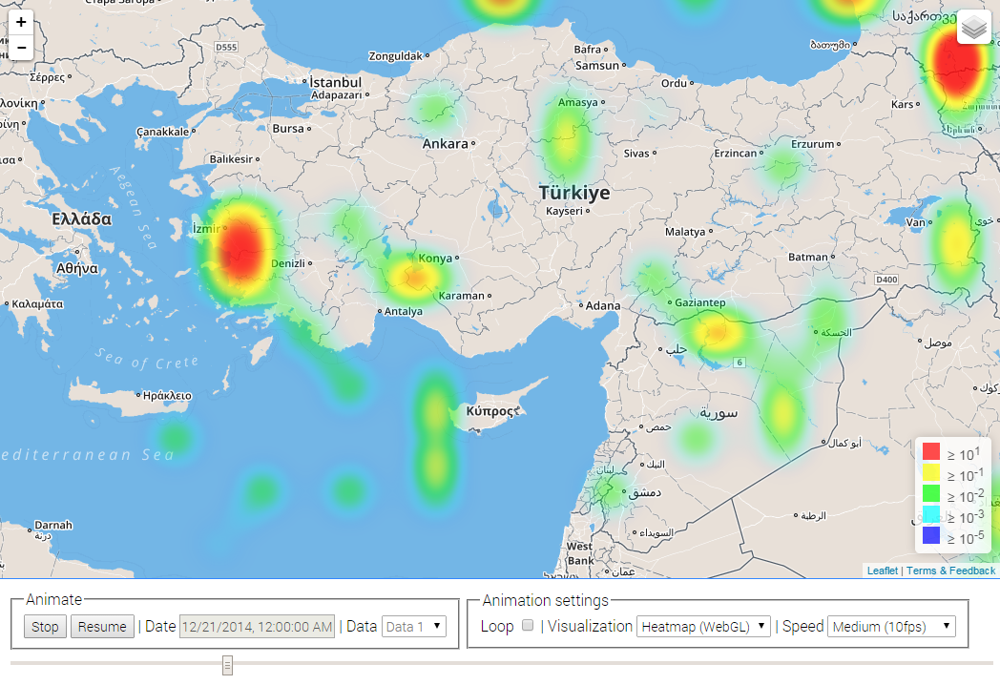
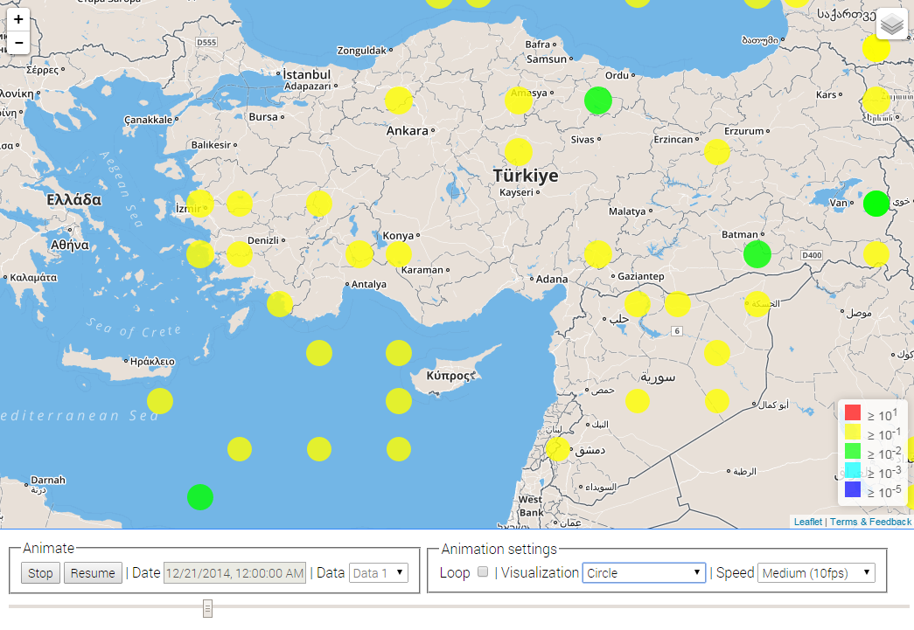

# Leaflet - Animated Data Layer

### Used software

JavaScript libraries

* [jQuery](http://jquery.com)
* [Leaflet](http://leafletjs.com/)
* (optional) [webgl-heatmap-leaflet](https://github.com/ursudio/webgl-heatmap-leaflet)
    * (optional) [webgl-heatmap](http://github.com/pyalot/webgl-heatmap)

### Getting started

* Open the [map-display.js](js/map/map-display.js) and modify the parameters in the `MapDisplay` constructor 
* Create the file `data/sampleData.js` and insert your data:

```
var sampleData = { ... , "data":
[
    {"date":1306188000, "points":
        [
            {"lat":32.0,"lon":-16.5,"val":0.00056},
            {"lat":36.0,"lon":-14.5,"val":0.02756},
            ...
        ]
    },
    {"date":1306191600, "points":
        [
            {"lat":33.0,"lon":-17.5,"val":0.00236},
            {"lat":37.0,"lon":-15.5,"val":0.03156},
            ...
        ]
    },
    ...
]};

```
(The `data` array contains entries, which have a timestamp in seconds as `date` and an array named `points`. This neasted array contains all points for the spefic `date` and each entry has a location (latitude `lat` and longitude `lon`) and a value `val`.)

### Demo and screenshots

**Demo**: http://xennis.github.io/Leaflet_Animated_Data_Layer/

Visualization type: heatmap



Visualization type: circle



### Credit

The idea of the animated layer based on the [NYTCommentsMap](https://github.com/alastaircoote/NYTCommentsMap) by [Alastair Coote](https://github.com/alastaircoote).